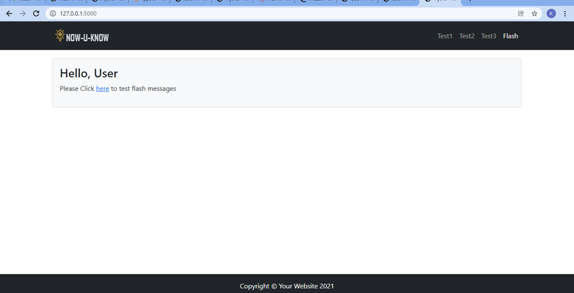
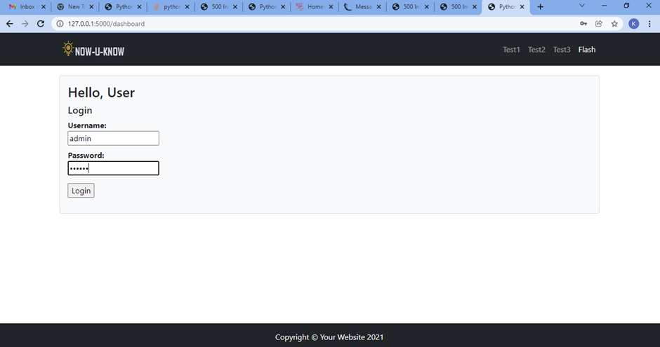
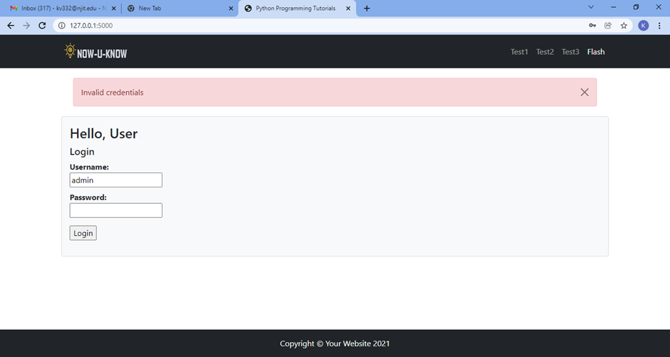
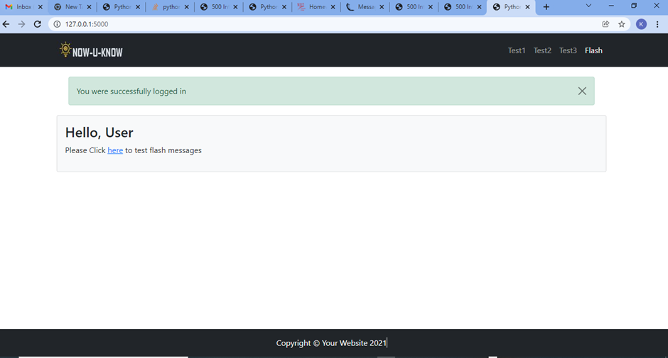

# Homework - Flash Messages and Validation

##### Flash message and validation 
1.Simple login functionality 
2. Flash messages - Success and failure on Login 
3. Bootstrap implemented for flash messages 

screenshots 
Homepage 

Login Dashboard

Login Failure

Login Success- Page redirects back to homepage showing Flash

Additonal Jinja sceenshots for flash categories followed professor weblink
[flashing patterns](https://docs.google.com/document/d/1uUM0_j7EgIyB2kwxaLZ5Z5yvC5G_0K7P/edit?usp=sharing&ouid=113074241322915041477&rtpof=true&sd=true)

