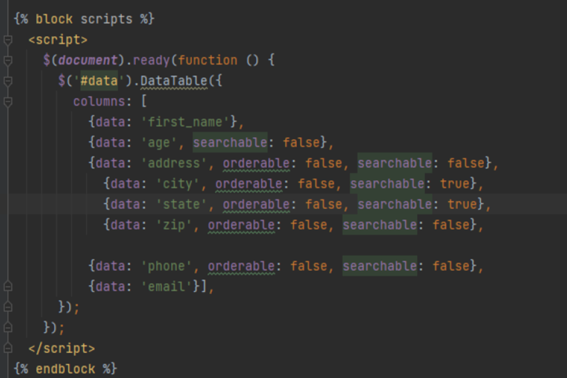
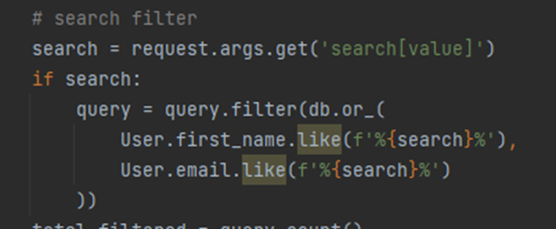

# Homework - Beautiful tables

##### Rendering a table with data in a Flask template
1.Creating fake data 
2.Bootstraping tables  
3.Basic table with enhancement 
3.Adding an Ajax Data Source 
3.Server-Driven Tablet 

screenshots 
Rendering a table in Flask 
1. Added additional columns in the sqllite db and created 100 fake records  
 
 

Basic Table

After Adding the following block for enhancing the page and the table

The output 

The output with search and sort capability
  

After adding Ajax 
 

Server-Driven Table

Searching based on the following code 

