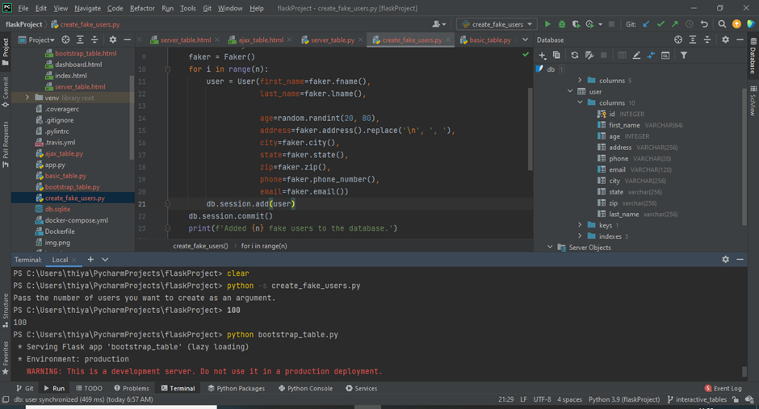
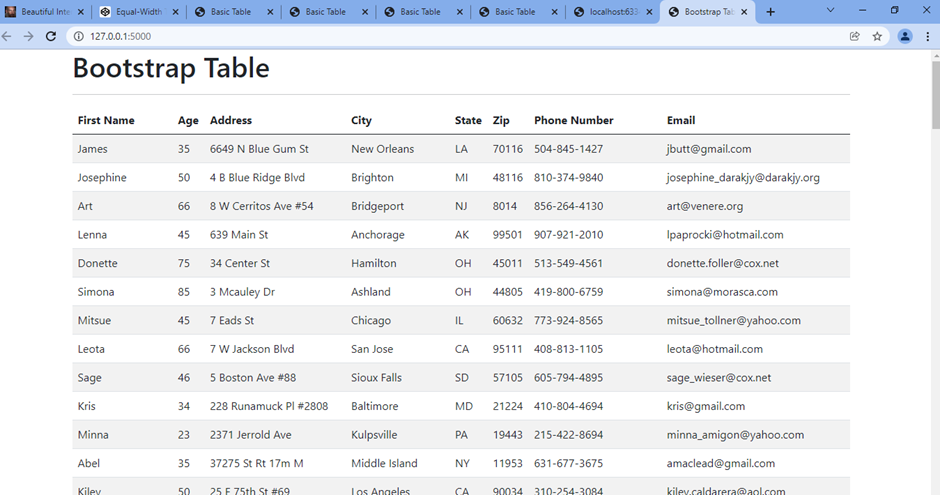
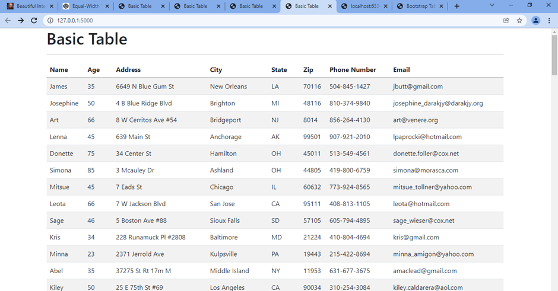
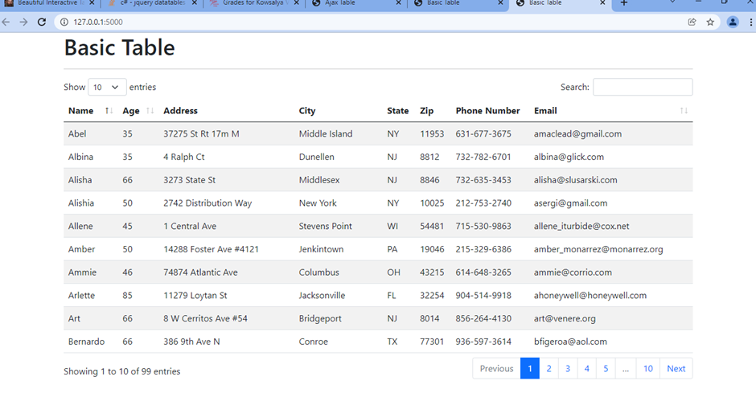
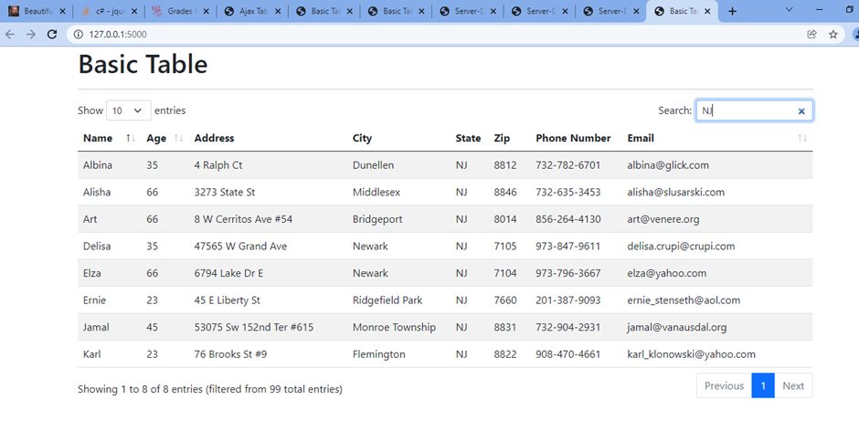
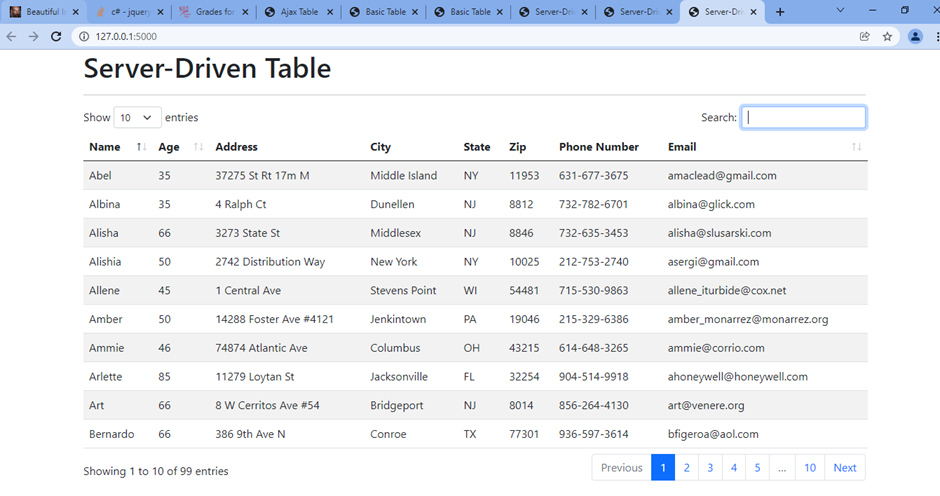
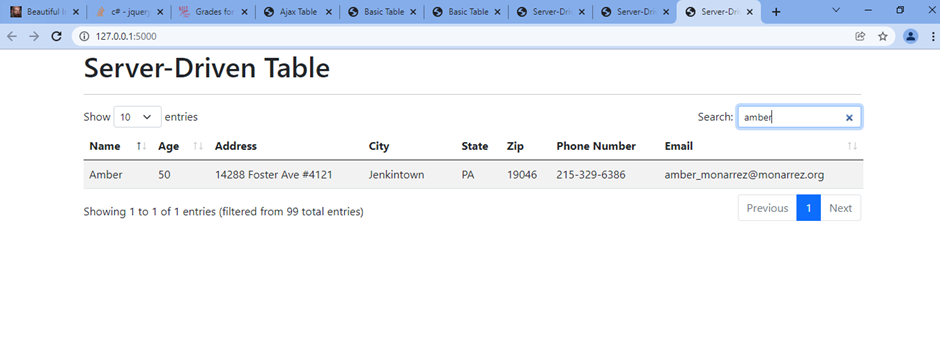
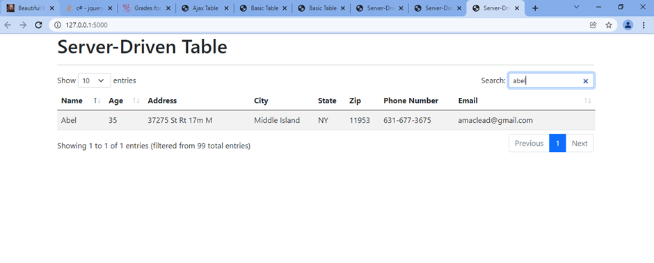

# Homework - Beautiful tables

#### Rendering a table with data in a Flask template 
    1.Creating fake data
    2.Bootstraping tables 
    3.Basic table with enhancement
    4.Adding an Ajax Data Source
    5.Server-Driven Tablet

#### Screenshots 
## Rendering a table in Flask  
    Added additional columns in the sqllite db and created 100 fake records 
 
 

## Basic Table  

    After Adding the following block for enhancing the page and the table
 

    The output
 

      The output with search and sort capability
  

## Ajax  
 

## Server Driven Tables  

    Searching based on the email 

    
    Searching based on the name 

